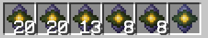
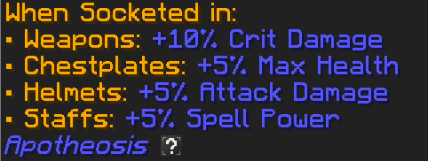
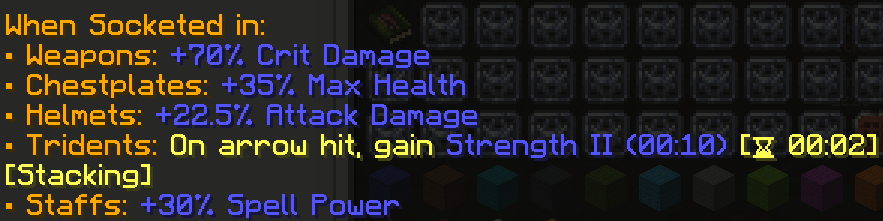
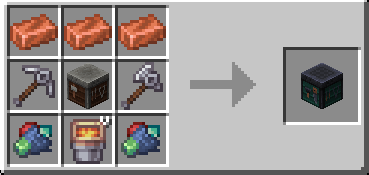
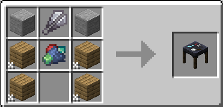
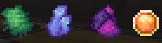
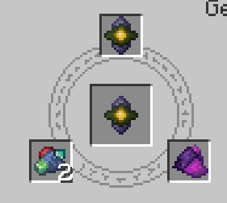

# Guide gemmes Apotheosis mod

## Rareté et obtention des gemmes

Les gemmes sont obtenables avec les donjons et en tuant des mobs. Il y a 6 catégories de gemmes: 
- Cracked (Common) 
- Chipped (Uncommon) 
- Flawed (Rare)
- Normal (Epic)
- Flawless (Legendary)
- Perfect (Perfect)

Chaque gemme est d'une catégorie, chaque catégorie a ses statisques propre. De plus, chaque catégorie a sa version dans toutes les raretés.
Plus la rareté d'une gemme est élevé, plus ses statisques seront **meilleurs** mais **jamais changé**. 
Cependant, elle peut apporter de nouvelle stats pour des équipements qu'elle ne prennait pas en charge avant.

*Exemple*:
*Gem of the Warlord* est trouvable en cracked, chipped, flawed, etc...

Elle augemente toujours les même statistiques.

## Augmenter la rareté d'une gemme

### La *gem dust*
L'augmentation d'une gemme d'une gemme nécessite de la *gem dust*. 
Pour obtenir de la *gem dust*, il faut passer soit par la *salvaging table* ou en faisant tombé une enclume sur une gemme (Moins efficace, à utiliser lorsque la *salvaging table* n'est pas encore créé). 

Obtenir de la *gem dust* revient donc à sacrifier une gemme. Plus la gemme sacrifié est rare, plus il y aura de *gem dust* en sortie (valable uniquement avec la *salvaging table*)

### Fonctionnement
Il est possible d'augmenter le niveau d'une gemme grâce à une *gem cutting table*. 

Pour augmenter une gemme, il faut sacrifier la même gemme que celle désiré. Il faut également de la *gem dust* et un **item de la rareté souhaité**.

Il existe un item pour augmenter dans chaque rareté (sauf pour perfect) :
- Mysterious scrap metal (common)
- Timeworn Fabric (uncommon)
- Luminous Crystal Shard (rare)
- Arcane Sands (epic)
- Godforged pearl (legendary)

Ainsi, une augmentation de gemme (vers epic) ressemble à ceci:
 
